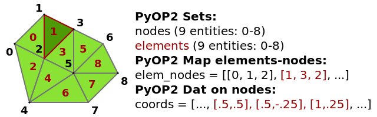
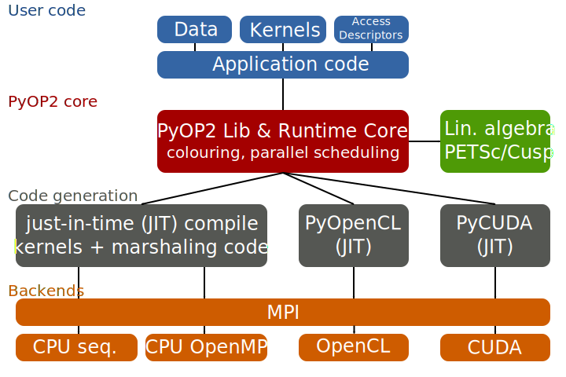
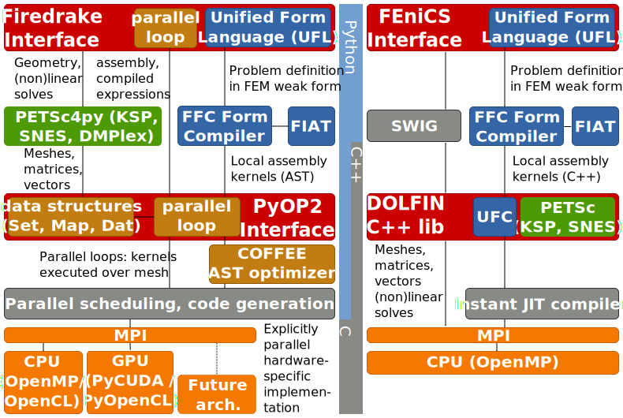
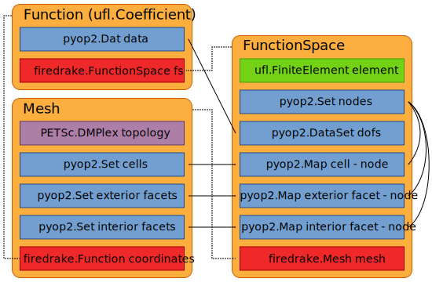
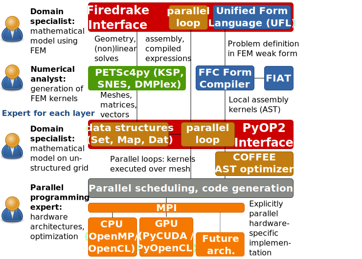

class: center, middle, inverse

# Firedrake: Re-imagining FEniCS by Composing Domain-specific Abstractions

## **Florian Rathgeber**<sup>1</sup>, Lawrence Mitchell<sup>1</sup>, David Ham<sup>1,2</sup>, Michael Lange<sup>3</sup>, Andrew McRae<sup>2</sup>, Fabio Luporini<sup>1</sup>, Gheorghe-teodor Bercea<sup>1</sup>, Paul Kelly<sup>1</sup>

.footnote[<sup>1</sup> Department of Computing, Imperial College London
<sup>2</sup> Department of Mathematics, Imperial College London  
<sup>3</sup> Department of Earth Science & Engineering, Imperial College London]

???

Good morning! My name is Florian and it is my pleasure to introduce Firedrake, a
re-imagination of the FEniCS concept by composing domain-specific abstraction.
Firedrake is developed by a group at Imperial, some which are in the room, so
I'll be presenting work of a number of people.

---

.scale[]

> The FEniCS Project is a collection of free software for automated, efficient
> solution of differential equations.
>
> .source[&mdash; fenicsproject.org]

???

When I say "re-imagining FEniCS", let's recap how the FEniCS project defines
itself on the website: ...

---

.scale[]

> Firedrake is an automated system for the **portable** solution of partial
> differential equations using the finite element method (FEM).
>
> .source[&mdash; firedrakeproject.org]

???

Firedrake's mission statement is very similar: ...

We'll get into more detail what makes Firedrake portable.

--

Two-layer abstraction for FEM computation from high-level descriptions:
* Firedrake: a portable finite-element computation framework  
  *Drive FE computations from a high-level problem specification*
* PyOP2: a high-level interface to unstructured mesh based methods  
  *Efficiently execute kernels over an unstructured grid in parallel*

???

The key concept is a layering of abstractions, with Firedrake as a portable
finite-element computation framework on top, allowing to drive computations from
a very high-level problem specification. The lower layer is PyOP2, a framework
for unstructured mesh computations, whose role is to efficiently execute kernels
over an unstructured mesh in parallel.

---

## The Firedrake/PyOP2 tool chain


???

This diagram shows an overview of the Firedrake / PyOP2 toolchain:

* Decoupling of Firedrake (FEM) and PyOP2 (parallelisation) layers
* (mostly) DOLFIN compatible API
* UFL to describe finite-element discretisation
* PETSc for linear/nonlinear solvers and mesh building / distribution
* Platform-specific runtime code generation and JIT compilation
* Portability for unstructured mesh applications: FEM, non-FEM or combinations
* Extensible framework beyond FEM computations (e.g. image processing)
* Revisit this diagram later

---

class: center, middle
# Parallel computations on unstructured meshes with PyOP2

???

Let's start at the bottom layer and look at parallel computations on
unstructured meshes with PyOP2.

---

.pull-left[
## Scientific computations on unstructured meshes

* Independent *local operations* for each element of the mesh described by a *kernel*.
* *Reductions* aggregate contributions from local operations to produce the final result.

### PyOP2

A domain-specific language embedded in Python for parallel computations on unstructured meshes or graphs.

### Unstructured mesh
.scale[]
]

???

PyOP2 was born from the realisation that scientific computations on unstructured
meshes often share the same structure: there is an independent local operation
that needs to be performed for every entity of the mesh and can be described by
a computational kernel. The final result is obtained from a reduction which
aggregates contributions from these local operations.

PyOP2 is a domain-specific language embedded in Python which implements this
principle for parallel computations on unstructured meshes or graphs.

--

.pull-right[
## PyOP2 Data Model

### Mesh topology
* ``Sets`` – cells, vertices, etc
* ``Maps`` – connectivity between entities in different sets

### Data
* ``Dats`` – Defined on sets (hold pressure, temperature, etc)

### Kernels
* Executed in parallel on a set through a parallel loop
* Read / write / increment data accessed via maps

### Linear algebra
* Sparsities defined by mappings
* Matrix data on sparsities
* Kernels compute a local matrix – PyOP2 handles global assembly
]

???

PyOP2 uses a number of simple primitives to describe unstructured meshes and
data defined on them:
* Set: abstractly defines class of entities, only know how big it is
* Map: defines connectivity between elements of sets, lookup table
* Dat: abstracted array, defined on a Set, contains actual values, which can
  live in  CPU or GPU memory
* Kernels:
  * define operations/computations to be performed independently for
    every entity of a given Set.
  * executed over the entire Set (or subset) in parallel (parallel loop)
  * have certain access modes for data they access
* take home: PyOP2 objects are bare/simple objects, but give powerful tools to
  express FE objects/constructs

---

## PyOP2 Architecture

.scale[]

???

PyOP2 architecture shown in this diagram:
* provides an API to the user (which may be another program, e.g. Firedrake)
* declare data types, exectute parallel loops (dynamic construct)
* PyOP2 runtime schedules computation efficiently (colouring avoids data races)
* code generated and JIT compiled at runtime for different backends
* CPU JIT: shell out to compiler to compile generated kernel + marshalling code
* use ctypes to load the compiled shared object
* No OpenCL and CUDA results this time (focussing on FEM features)

---

class: center, middle

# Finite-element computations with Firedrake

???

How can Firedrake make use of that for FE computations?

---

## Firedrake vs. DOLFIN tool chains

.scale[]

???

Version of the diagram that compares Firedrake and DOLFIN/FEniCS tool chains:

* Key design decision:
  * Python as main language (c.f. language bar in the middle)
  * only lower to C for kernel execution
  * speed up performance-critical library code with Cython extension modules
    (mesh, sparsity building)
  * decompose and selectively lower high-level Firedrake constructs instead of
    exposing functionality of C++ API to Python via SWIG
* FFC not responsible for optimisation of code (role is only to produce an
  abstract kernel loop nest suitable for optimisation by COFFEE)
  * DOLFIN: FFC generates C++ string conforming to UFC interface
  * Firedrake: FFC generates a kernel suitable for execution by PyOP2
* UFC vs. parallel loops
  * in UFC every kernel type has a special interface
  * have to extend UFC if you want to do anything that is not yet specified
  * parallel loop interface is completely flexible
* escape hatch for things not expressible in UFL: e.g. compute maximum of CG
  and DG functions for every CG DOF (slope limiters)
* we control C kernels completely, can use ctypes for lightweight interfacing

* PyOP2 as parallel execution layer for assembly kernels: responsible for
  storage, transfer and communication of data
* PETSc used for meshes (DMPlex), nonlinear solves (SNES), linear solves (KSP, PC)
* *No parallel code*: parallelism handled by PyOP2 + PETSc

---

.left30[
### Function
Field defined on a set of degrees of freedom (DoFs), data stored as PyOP2 `Dat`
### FunctionSpace
Characterized by a family and degree of FE basis functions, defines DOFs for function and relationship to mesh entities
### Mesh
Defines abstract topology by sets of entities and maps between them (PyOP2 data structures)
]

.right70[
## Firedrake concepts

]

---

## Driving Finite-element Computations in Firedrake

Solving the Helmholtz equation in Python using Firedrake:
`$$\int_\Omega \nabla v \cdot \nabla u - \lambda v u ~dV = \int_\Omega v f ~dV$$`

```python
from firedrake import *

# Read a mesh and define a function space
mesh = Mesh('filename')
V = FunctionSpace(mesh, "Lagrange", 1)

# Define forcing function for right-hand side
f = Expression("- (lmbda + 2*(n**2)*pi**2) * sin(X[0]*pi*n) * sin(X[1]*pi*n)",
               lmbda=1, n=8)

# Set up the Finite-element weak forms
u = TrialFunction(V)
v = TestFunction(V)

lmbda = 1
a = (dot(grad(v), grad(u)) - lmbda * v * u) * dx
L = v * f * dx

# Solve the resulting finite-element equation
p = Function(V)
*solve(a == L, p)
```

---

## Behind the scenes of the solve call

* Unified interface: Firedrake always solves nonlinear problems in resdiual form `F(u;v) = 0` using Newton-like methods
* Transform linear problem with bilinear form `a`, linear form `L` into residual form:
  ```python
  J = a
  F = ufl.action(J, u) - L
  ```
  Jacobian known to be `a`; **always** solved in a single Newton (nonlinear) iteration
* PETSc SNES requires two callbacks to evaluate residual and Jacobian:
  * evaluate residual: assemble residual form
    ```python
    assemble(F, tensor=F_tensor)
    ```
  * evaluate Jacobian: assemble Jacobian form
    ```python
    assemble(J, tensor=J_tensor, bcs=bcs)
    ```

???

* If Jacobian not provided by the user, Firedrake uses automatic differentiation:
  ```python
  J = ufl.derivative(F, u)
  ```

---

## Applying boundary conditions

* Always applied in a way that preserves symmetry of the operator
* Zeroing of matrix rows/columns during assembly, requires boundary DOFs
* Leverage PETSc to avoid costly zeroing of CSR columns
  * on assembly, set row/column indices of boundary DOFs to negative values
  * instructs PETSc to drop contributions, leaving a 0 in assembled matrix

--

## Preassembly

.left30[
```python
A = assemble(a)
b = assemble(L)
solve(A, p, b, bcs=bcs)
```
]
.right70[
* How can we call assembly before knowing final BCs?
* BCs may change between point of assembly and solve
* assembly returns unassembled matrix with assembly "thunk" (recipe), called with BCs when solving
* Assembly is cached
  * pre-assembly not required in most circumstances
  * Matrices record BCs they have been assembled with, no need for reassembly
  * assembly cache has FIFO eviction strategy
]

???

* Unified interface: assemble a UFL form into a global tensor
  * bilinear form: assemble matrix (optionally with boundary conditions)
  * linear form: assemble vector (optionally with boundary conditions)
  * functional: assemble scalar value
* UFL form may contain one or more integrals over cells, interior and exterior facets
* Each integral: local assembly kernel performing numerical quadrature
* Kernels generated by FFC and executed as PyOP2 parallel loops
  * Firedrake builds PyOP2 parallel loop call, using FFC-generated kernel
  * iterate over cells (for cell integrals) or facets (interior/exterior facet integrals)
  * output tensor depends on rank of the form (PyOP2 `Mat`, `Dat` or `Global`)
  * input arguments: coordinate field and any coefficients present in the form

---

## Distributed Parallel Computations with MPI

.left30[
* Mesh partitioned among processors
* Computations on boundaries require up-to-date *halo* data
* Enforce constraint on local mesh numbering for efficient comp-comm overlap
* Entities that do not touch the boundary can be computed while halo data exchange is in flight
* Halo exchange is automatic and happens only if halo is "dirty"
]

--

.right70[
### Local mesh entities partioned into four sections
* **Core:** Entities owned by this processor which can be processed without
  accessing halo data.
* **Owned:** Entities owned by this processor which access halo data when
  processed.
* **Exec halo:** Off-processor entities redundantly executed over
  because they touch owned entities.
* **Non-exec halo:** Off-processor entities which are not processed, but
  read when computing the exec halo.


]

---

## Benchmarks

### Hardware
* Intel Xeon E5-2620 @ 2.00GHz (Sandy Bridge)
* 16GB RAM

### Compilers
* Intel Compilers 14.0.1
* Intel MPI 3.1.038
* Compiler flags: -O3 -xAVX

### Software
* DOLFIN 389e0269 (April 4 2014)
* Firedrake 570d999 (May 13 2014)
* PyOP2 e775c5e (May 9 2014)

### Problem setup
* DOLFIN + Firedrake: RCM mesh reordering enabled
* DOLFIN: quadrature with optimisations enabled
* Firedrake: quadrature with COFFEE loop-invariant code motion enabled

???

* only quadrature supported in Firedrake

---

## Poisson benchmark

.left-column[
preassembled system

### Solver
CG
### Preconditioner
Hypre Boomeramg
]

.right-column[
```python
V = FunctionSpace(mesh, "Lagrange", degree)

# Dirichlet BC for x = 0 and x = 1
bc = DirichletBC(V, 0.0, [3, 4])

# Test, trial and coefficient functions
u = TrialFunction(V)
v = TestFunction(V)
f = Function(V).interpolate(Expression(
        "10*exp(-(pow(x[0] - 0.5, 2) + \
        pow(x[1] - 0.5, 2)) / 0.02)"))
g = Function(V).interpolate(Expression("sin(5*x[0])"))

# Bilinear and linear forms
a = inner(grad(u), grad(v))*dx
L = f*v*dx + g*v*ds

# Pre-assemble and solve
u = Function(V)
A = assemble(a, bcs=bc)
b = assemble(L)
bc.apply(b)

solve(A, u, b, solver_parameters=params)
```
]

---


### solid: Firedrake, dashed: DOLFIN

---


### solid: Firedrake, dashed: DOLFIN

---


### solid: Firedrake, dashed: DOLFIN

---

### Incompressible Navier-Stokes benchmark (Chorin's method)

.left-column[
preassembled system

### Solver
* GMRES for tentative velocity + velocity correction
* CG for pressure correction

### Preconditioner
* block-Jacobi
* ILU block preconditioner
]

.right-column[
```python
V = VectorFunctionSpace(mesh, "Lagrange", 2)
Q = FunctionSpace(mesh, "Lagrange", 1)
u, p = TrialFunction(V), TrialFunction(Q)
v, q = TestFunction(V), TestFunction(Q)

dt = 0.01
nu = 0.01
p_in = Constant(0.0)

noslip = DirichletBC(V, Constant((0.0, 0.0)), (1, 3, 4, 6))
inflow = DirichletBC(Q, p_in, 5)
outflow = DirichletBC(Q, 0, 2)
bcu = [noslip]
bcp = [inflow, outflow]

u0, u1, p1 = Function(V), Function(V), Function(Q)
k = Constant(dt)
f = Constant((0, 0))

# Tentative velocity step
F1 = (1/k)*inner(u - u0, v)*dx + inner(grad(u0)*u0, v)*dx + \
    nu*inner(grad(u), grad(v))*dx - inner(f, v)*dx
a1, L1 = lhs(F1), rhs(F1)

# Pressure update
a2 = inner(grad(p), grad(q))*dx
L2 = -(1/k)*div(u1)*q*dx

# Velocity update
a3 = inner(u, v)*dx
L3 = inner(u1, v)*dx - k*inner(grad(p1), v)*dx
```
]

---


### solid: Firedrake, dashed: DOLFIN

---


### solid: Firedrake, dashed: DOLFIN

---


### solid: Firedrake, dashed: DOLFIN

---


### solid: Firedrake, dashed: DOLFIN

---


### solid: Firedrake, dashed: DOLFIN

---


### solid: Firedrake, dashed: DOLFIN

---

## Summary and additional features

### Summary
* Two-layer abstraction for FEM computation from high-level descriptions
  * Firedrake: a performance-portable finite-element computation framework  
    *Drive FE computations from a high-level problem specification*
  * PyOP2: a high-level interface to unstructured mesh based methods  
    *Efficiently execute kernels over an unstructured grid in parallel*
* Decoupling of Firedrake (FEM) and PyOP2 (parallelisation) layers
* Platform-specific runtime code generation and JIT compilation
* Portability for unstructured mesh applications: FEM, non-FEM or combinations
* Extensible framework beyond FEM computations (e.g. image processing)

--

### Preview: Firedrake features not covered
* Building meshes using PETSc DMPlex
* Communication-computation overlap when running MPI-parallel
* Using fieldsplit preconditioners for mixed problems
* Solving PDEs on extruded (semi-structured) meshes
* Solving PDEs on immersed manifolds
* Automatic optimization of generated assembly kernels with COFFEE
* ...

---

## Thank you!

Contact: Florian Rathgeber, [@frathgeber](https://twitter.com/frathgeber), <f.rathgeber@imperial.ac.uk>

### Resources

  * **PyOP2** https://github.com/OP2/PyOP2
    * *[PyOP2: A High-Level Framework for Performance-Portable Simulations on Unstructured Meshes](http://dx.doi.org/10.1109/SC.Companion.2012.134)*
      Florian Rathgeber, Graham R. Markall, Lawrence Mitchell, Nicholas Loriant, David A. Ham, Carlo Bertolli, Paul H.J. Kelly,
      WOLFHPC 2012
    * *[Performance-Portable Finite Element Assembly Using PyOP2 and FEniCS](http://link.springer.com/chapter/10.1007/978-3-642-38750-0_21)*
       Graham R. Markall, Florian Rathgeber, Lawrence Mitchell, Nicolas Loriant, Carlo Bertolli, David A. Ham, Paul H. J. Kelly ,
       ISC 2013
  * **Firedrake** https://github.com/firedrakeproject/firedrake
    * *COFFEE: an Optimizing Compiler for Finite Element Local Assembly*
      Fabio Luporini, Ana Lucia Varbanescu, Florian Rathgeber, Gheorghe-Teodor Bercea, J. Ramanujam, David A. Ham, Paul H. J. Kelly,
      submitted
  * **UFL** https://bitbucket.org/mapdes/ufl
  * **FFC** https://bitbucket.org/mapdes/ffc

**This talk** is available at http://kynan.github.io/fenics14 ([source](https://github.com/kynan/fenics14))

Slides created with [remark](http://remarkjs.com)

---

class: center, middle, inverse

# Backup

---

## Solve implementation
```python
def solve(problem, solution,
          bcs=None, J=None,
          solver_parameters=None)
```

1. If problem is linear, transform into residual form
2. If no Jacobian provided, compute Jacobian by automatic differentiation
3. Set up PETSc SNES solver (parameters user configurable)
4. Assign residual and Jacobian forms for SNES callbacks
5. Solve nonlinear problem. For each nonlinear iteration:
  a) assemble Jacobian matrix
  b) assemble residual vector
  c) solve linear system using PETSc KSP

---

## Two-layered abstraction: Separation of concerns



---

background-image:url(images/fem.svg)

---

.left-column[
## Helmholtz local assembly kernel generated by FFC

The [FEniCS Form Compiler](https://bitbucket.org/fenics-project/ffc) FFC compiles UFL forms to low-level code.
]
.right-column[
### Weak form of the Helmholtz equation
`$$\int_\Omega \nabla v \cdot \nabla u - \lambda v u ~dV = \int_\Omega v f ~dV$$`

### Corresponding UFL form
```python
a = (dot(grad(v), grad(u)) - lmbda * v * u) * dx
```

### FFC-generated C kernel
```c
// A - local tensor to assemble
// x - local coordinates
// j, k - 2D indices into the local assembly matrix
void kernel(double A[1][1], double *x[2],
            int j, int k) {
  // FE0 - Shape functions
  // Dij - Shape function derivatives
  // Kij - Jacobian inverse / determinant
  // W3  - Quadrature weights
  // det - Jacobian determinant
  for (unsigned int ip = 0; ip < 3; ip++) {
    A[0][0] += (FE0[ip][j] * FE0[ip][k] * (-1.0)
      + (((K00 * D10[ip][j] + K10 * D01[ip][j]))
        *((K00 * D10[ip][k] + K10 * D01[ip][k]))
      +  ((K01 * D10[ip][j] + K11 * D01[ip][j]))
        *((K01 * D10[ip][k] + K11 * D01[ip][k]))))*W3[ip]*det;
  }
}
```
]

---

.left-column[
## PyOP2 Kernels and Parallel Loops

Performance portability for *any* unstructured mesh computations
]
.right-column[
### Parallel loop syntax
```python
op2.par_loop(kernel, iteration_set,
             kernel_arg1(access_mode, mapping[index]),
             ...,
             kernel_argN(access_mode, mapping[index]))
```

### PyOP2 program for computing the midpoint of a triangle
```python
from pyop2 import op2
op2.init()

vertices = op2.Set(num_vertices)
cells = op2.Set(num_cells)

cell2vertex = op2.Map(cells, vertices, 3, [...])

coordinates = op2.Dat(vertices ** 2, [...], dtype=float)
midpoints = op2.Dat(cells ** 2, dtype=float)

midpoint = op2.Kernel("""
void midpoint(double p[2], double *coords[2]) {
  p[0] = (coords[0][0] + coords[1][0] + coords[2][0]) / 3.0;
  p[1] = (coords[0][1] + coords[1][1] + coords[2][1]) / 3.0;
}""", "midpoint")

op2.par_loop(midpoint, cells,
             midpoints(op2.WRITE),
             coordinates(op2.READ, cell2vertex))
```
Future work: define kernels as Python functions
]

---

## Generated sequential code calling the midpoint kernel

```c
// Kernel provided by the user
static inline void midpoint(double p[2], double *coords[2]) {
  p[0] = (coords[0][0] + coords[1][0] + coords[2][0]) / 3.0;
  p[1] = (coords[0][1] + coords[1][1] + coords[2][1]) / 3.0;
}

// Generated marshaling code executing the sequential loop
void wrap_midpoint(int start, int end,
                   double *arg0_0, double *arg1_0, int *arg1_0_map0_0) {
  double *arg1_0_vec[3];
  for ( int n = start; n < end; n++ ) {
    int i = n;
    arg1_0_vec[0] = arg1_0 + (arg1_0_map0_0[i * 3 + 0])* 2;
    arg1_0_vec[1] = arg1_0 + (arg1_0_map0_0[i * 3 + 1])* 2;
    arg1_0_vec[2] = arg1_0 + (arg1_0_map0_0[i * 3 + 2])* 2;
*    midpoint(arg0_0 + i * 2, arg1_0_vec);  // call user kernel (inline)
  }
}
```

---

## Generated OpenMP code calling the midpoint kernel

```c
// Kernel provided by the user
static inline void midpoint(double p[2], double *coords[2]) {
  p[0] = (coords[0][0] + coords[1][0] + coords[2][0]) / 3.0;
  p[1] = (coords[0][1] + coords[1][1] + coords[2][1]) / 3.0;
}

// Generated marshaling code executing the parallel loop
void wrap_midpoint(int boffset, int nblocks,
                   int *blkmap, int *offset, int *nelems,
                   double *arg0_0, double *arg1_0, int *arg1_0_map0_0) {
  #pragma omp parallel shared(boffset, nblocks, nelems, blkmap) {
    int tid = omp_get_thread_num();
    double *arg1_0_vec[3];
    #pragma omp for schedule(static)
    for ( int __b = boffset; __b < boffset + nblocks; __b++ ) {
      int bid = blkmap[__b];
      int nelem = nelems[bid];
      int efirst = offset[bid];
      for (int n = efirst; n < efirst+ nelem; n++ ) {
        int i = n;
        arg1_0_vec[0] = arg1_0 + (arg1_0_map0_0[i * 3 + 0])* 2;
        arg1_0_vec[1] = arg1_0 + (arg1_0_map0_0[i * 3 + 1])* 2;
        arg1_0_vec[2] = arg1_0 + (arg1_0_map0_0[i * 3 + 2])* 2;
*        midpoint(arg0_0 + i * 2, arg1_0_vec);  // call user kernel (inline)
      }
    }
  }
}
```
